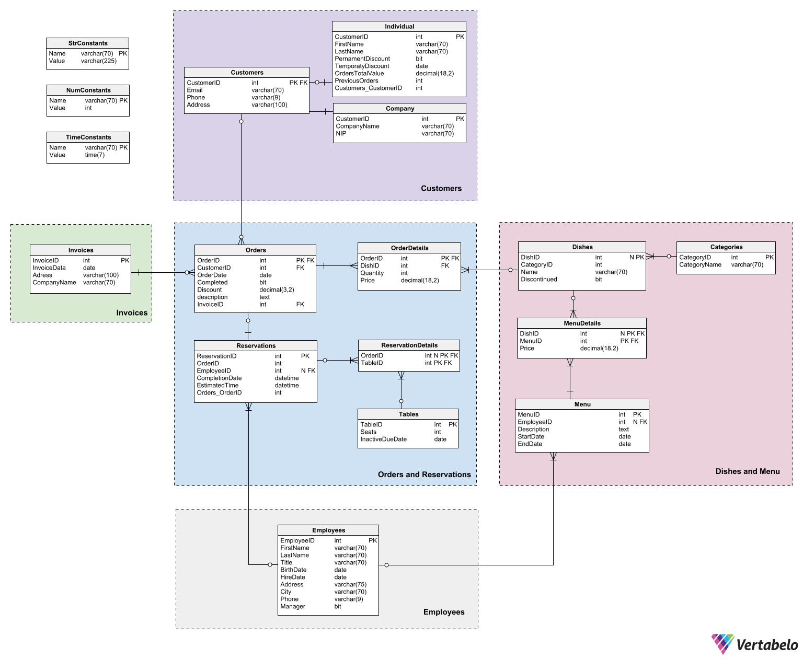

# Restaurant database - MS SQL

_Authors: Weronika Witek, Ewa Miklewska, Igor Sitek_

Group project created during Introduction to Databases course during III term of AGH Computer Science.
Project written in MS SQL using transact-SQL dialect.

## Database diagram

 

## System functionalities
### Customer
* makes orders online with prerequisites:
  * seafood can be ordered up to Monday before order completion (these orders are realised
  from Friday to Sunday),
  * everyone can pay via restaurant website,
  * to pay for online order in a restaurant the customer had to have big enough amount of orders
  and this particular order has to have big enough value,
  * orders have to be made at least day before completion,
* requests generating invoices for his orders.
#### Individual (also a customer)
* capable of using discounts (that are automatically used in orders)
  * permanent discount is granted after certain amount of orders and every of them has to 
  certain minimal value,
  * single discount used during next order, valid certain amount of days after granting, 
  granted after making certain value of all orders in total,
  * discounts do not stack.
#### Company (also a customer)
  * catering - making bigger take-out orders,
  * capable of making reservations on whole company or certain employees.
### Staff member
  * views reserved tables and pending orders,
  * validates reservations and estimate time of their duration,
  * generates invoices for customers.
#### Manager (also staff member)
  * creates new menu,
    * adds new dishes to database,
    * chooses dishes to be included in new menu,
    * can create menu in advance (menu that will be in use in the future),
    * menu has to be changed every two weeks and half of current dishes has to be different,
    * confirmed menu cannot be changed (it would generate a problem with already made orders
    and reservations),
    * generates month and week reports
    * generates reports for customers with history of orders
    * manages conditions of granting discounts
    * manages conditions of enabling customers to pay for online order in a restaurant.